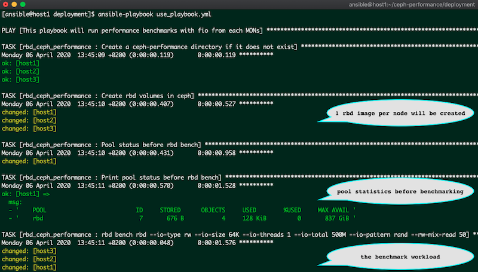
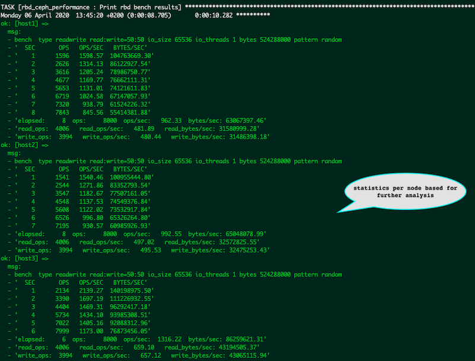
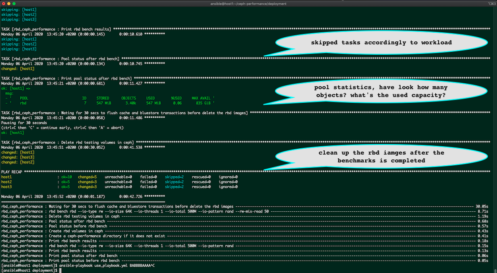
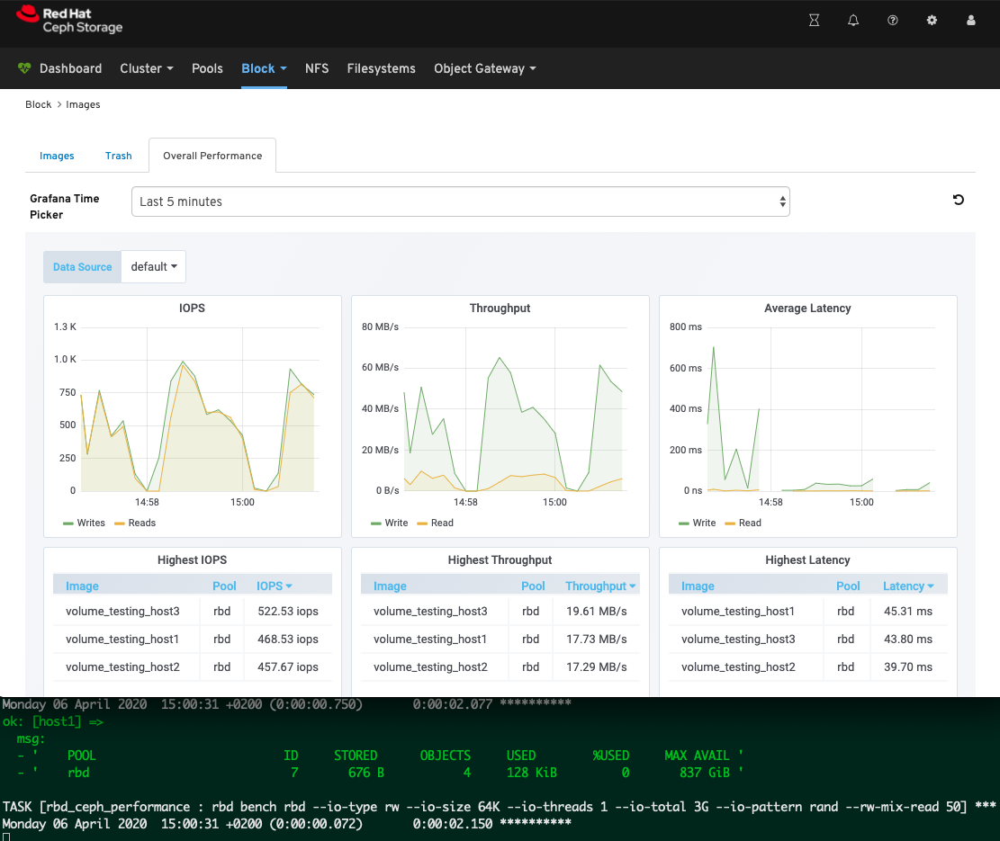

# Benchmark Ceph cluster with rbd bench on RHCS v4

## Introduction 
This ansible role can help you to automate benchmarking in ceph and collect some useful performance statistics.  
Ceph admin keys or ceph keys that include "allow rwx pool=POOL_TO_TEST" is required on clients to create and delete rbd images, after completed the bechmarking remove the admin keys if not more required.
Hope this can help you, any comments are more than welcome please send me an email to carlos.torres.alayo@gmail.com 

WARNING: An important requirement is ceph-common package, for example in RHEL you can install it based on your version by following the instructions available here: 

https://access.redhat.com/documentation/en-us/red_hat_ceph_storage/4/html-single/installation_guide/index#using-the-command-line-interface-to-install-the-ceph-software

## What this playbook can do for you?
The role will automate following workflow:
- Use the hosts defined in your inventory group, example [clients] from ceph-ansible inventory
- Create a dedicated rbd images in the format rbd_name_{{ ansible_hostname }}
- Run "rbd bench" in parallel from each client
- The "rbd bench" statistics are reported in the standard output you can redirect to file for further analysis
- Multiple workload and profiles are supported in this role: :
  - profile: sequential, random
  - type: write, read, rw 
  - block size: 4K, 8K, 16K, 32K, 64K, 128K, 256K, 512K, 1024K, 2048K, 4096K
  - file size: XXXG  (XXX is the size of amount of data to transfer) 

## Testing environment
We have 3 nodes in the ceph cluster, each node works at the same time as a client: 

    [ansible@host1 deployment]$ ansible-inventory --graph
    @all:
      |--@clients:
      |  |--host1
      |  |--host2
      |  |--host3
      |--@grafana-server:
      |  |--host1
      |--@iscsigws:
      |  |--host1
      |  |--host2
      |--@mdss:
      |  |--host2
      |  |--host3
      |--@mgrs:
      |  |--host1
      |  |--host2
      |  |--host3
      |--@mons:
      |  |--host1
      |  |--host2
      |  |--host3
      |--@osds:
      |  |--host1
      |  |--host2
      |  |--host3
      |--@rgws:
      |  |--host2
      |  |--host3
      |--@ungrouped:

In my lab I running Red Hat Cep Storage v4:  

    [ansible@host1 deployment]$ sudo ceph --version
    ceph version 14.2.4-125.el8cp (db63624068590e593c47150c7574d08c1ec0d3e4) nautilus (stable)

In the Ceph cluster we have 9 OSDs:
    
    [ansible@host1 deployment]$ sudo ceph osd tree
    ID CLASS WEIGHT  TYPE NAME      STATUS REWEIGHT PRI-AFF
    -1       0.87025 root default
    -5       0.29008     host host1
    0   hdd 0.09669         osd.0      up  1.00000 1.00000
    3   hdd 0.09669         osd.3      up  1.00000 1.00000
    6   hdd 0.09669         osd.6      up  1.00000 1.00000
    -7       0.29008     host host2
    1   hdd 0.09669         osd.1      up  1.00000 1.00000
    4   hdd 0.09669         osd.4      up  1.00000 1.00000
    7   hdd 0.09669         osd.7      up  1.00000 1.00000
    -3       0.29008     host host3
    2   hdd 0.09669         osd.2      up  1.00000 1.00000
    5   hdd 0.09669         osd.5      up  1.00000 1.00000
    8   hdd 0.09669         osd.8      up  1.00000 1.00000

And based on Nautilus version the default object store is bluestore, we can easily check with this command:

    [ansible@host1 deployment]$ sudo ceph osd tree | grep "osd." | awk '{print $4}' | while read osd; do echo $osd; sudo ceph osd metadata osd.$i | grep osd_objectstore ; done
    osd.0
        "osd_objectstore": "bluestore",
    osd.3
        "osd_objectstore": "bluestore",
    osd.6
        "osd_objectstore": "bluestore",
    osd.1
        "osd_objectstore": "bluestore",
    osd.4
        "osd_objectstore": "bluestore",
    osd.7
        "osd_objectstore": "bluestore",
    osd.2
        "osd_objectstore": "bluestore",
    osd.5
        "osd_objectstore": "bluestore",
    osd.8
        "osd_objectstore": "bluestore",

The workload is defined in the followig variables:

    [ansible@host1 deployment]$ cat roles/rbd_ceph_performance/defaults/main.yml
      ---
      pool_name: 'rbd'
      rbd_name: 'volume_testing'
      rbd_size: '5G'
      io_type: 'rw'
      io_size: '64K'
      io_threads: '1'
      io_total: '3G'
      io_pattern: 'rand'
      rw_mix_read: 50
      rbd_image_name: '{{ rbd_name }}_{{ ansible_hostname }}'
      path_fio_files: '/root/ceph_performance'

## Let's have fun

Create an ansible playbook by using the role, following an example:

    ---
    - name: 'Using ansible rbd_ceph_performance role'
      hosts: clients
      become: true
      roles:
        - rbd_ceph_performance

Now let's share some screenshots with comments:

While the benchmark is running you can monitor performance in real time  from RHCS v4 dashboard  

